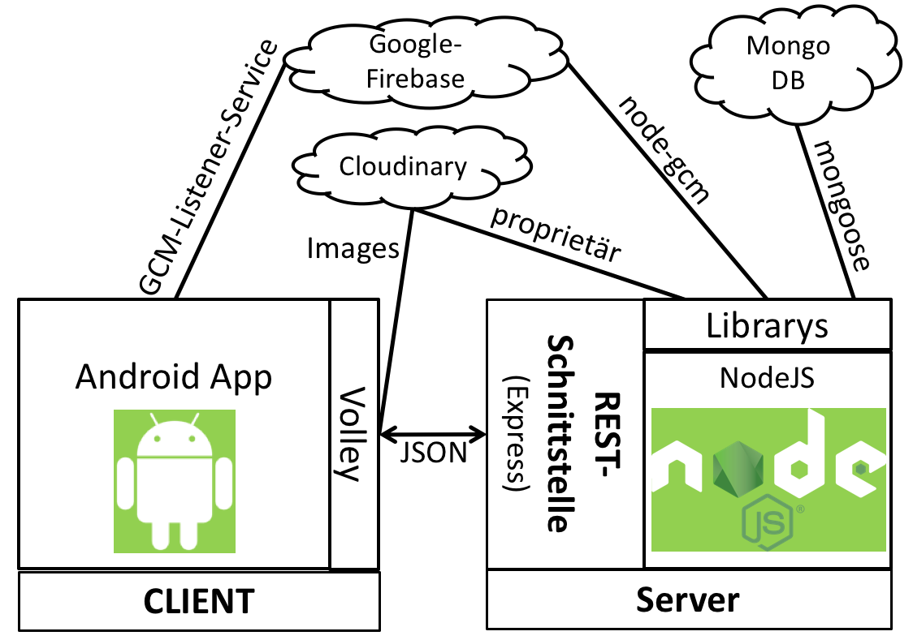
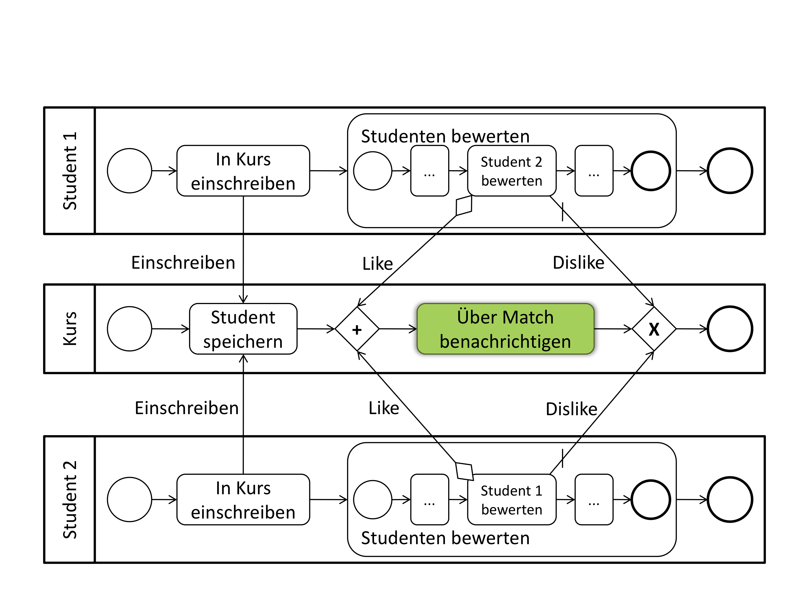
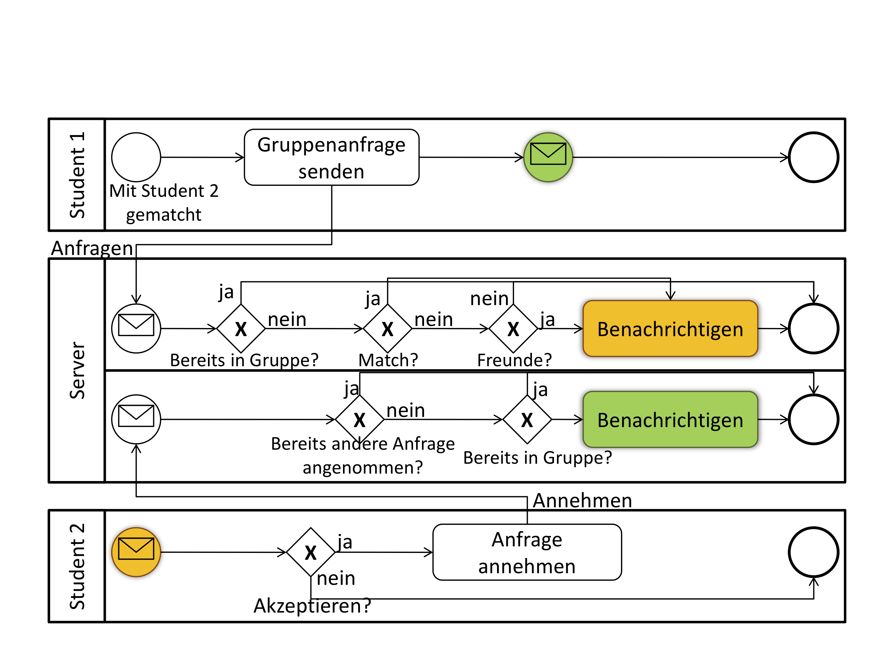

# Tutiner
Fancy App for finding appropriate partners for University Tutorial Sessions. ;-)

## Architecture

## Matchingprocess

## Group Building

## Credits
It has been a 3-Person Project:
 - https://github.com/mskr 
 - https://github.com/1uk4s
 - https://github.com/snap10

## CAUTION 
This System is a unfinished but still working. It is not further maintained and not supported anymore.

## Requirements
The System was based on Google Cloud Messaging (GCM) for which you have to get your own credentials and put them into the Backend and the MobileApp Google_services.json
Furthermore we utilized Image Functionality from SaaS Provider Cloudinary, where you have to get your own free Account.
The Backend relies on a working NodeJS Environment and has to be self-hosted, make sure to enter your own backend-address in volley-singleton.java File in the Singleton-Package.

## Disclaimer
We are not responsible for anything you do, any damage or other stuff that happens in some form of combination with this system.

